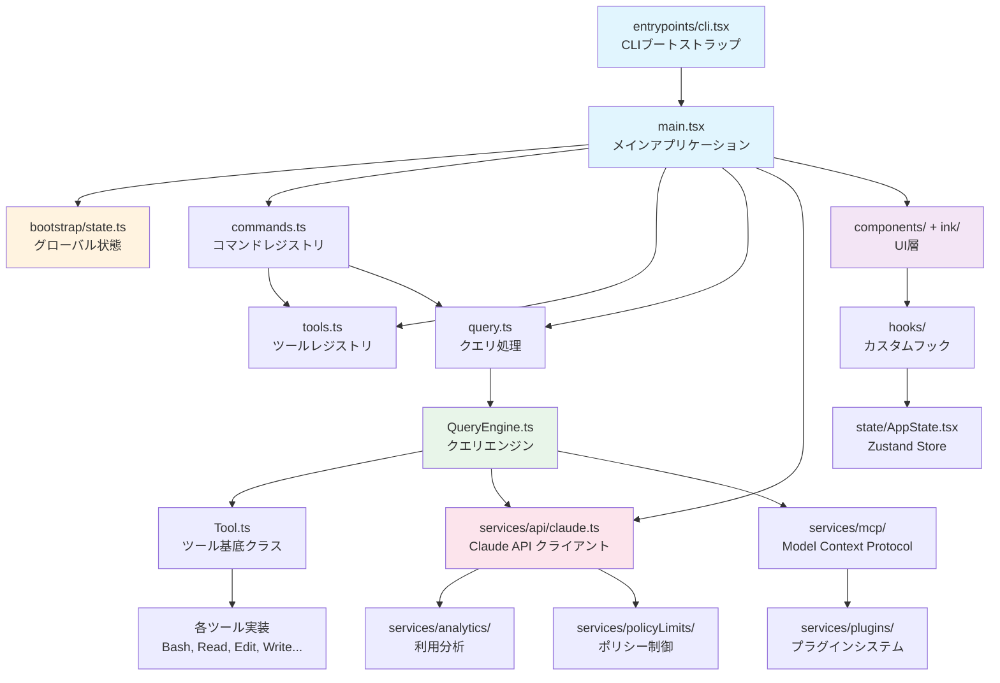
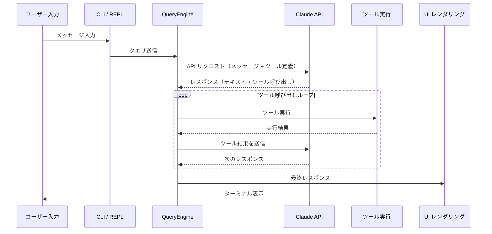
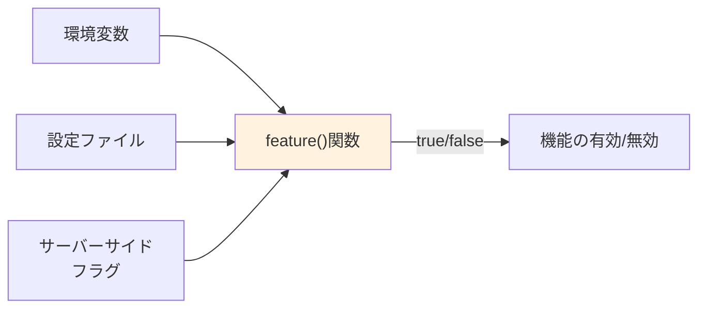
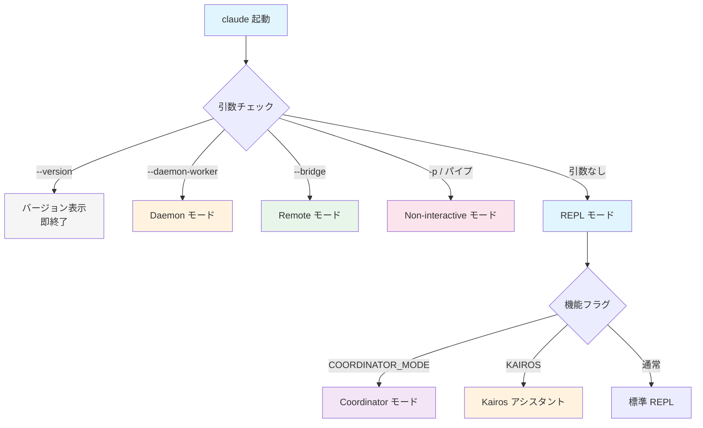

# Claude Code 全体アーキテクチャ解析

## 1. 全体統計

| 指標 | 値 |
|---|---|
| ファイル総数 | **1,884個** |
| `.ts` ファイル | 1,332 |
| `.tsx` ファイル | 552 |
| `.js` ファイル | 18 |
| 総行数 | **188,314行** |
| 主要言語 | TypeScript（厳密モード） |
| ランタイム | Bun |
| UI フレームワーク | React + Ink（ターミナルUI） |

---

## 2. トップレベルディレクトリ構成

| ディレクトリ | 行数 | 役割 |
|---|---|---|
| `utils/` | 180,472 | ユーティリティ・ヘルパー関数（暗号化、diff、ファイル操作、Git連携、トークン計算等） |
| `components/` | 81,546 | React UIコンポーネント（メッセージ表示、入力、ツール結果表示等） |
| `services/` | 53,680 | API通信・認証・MCP・LSP・プラグイン管理 |
| `tools/` | 50,828 | ツール定義と実装（40種以上：Bash, Read, Edit, Write, Grep, Glob等） |
| `commands/` | 26,428 | スラッシュコマンド（80個以上：/help, /clear, /commit, /review-pr等） |
| `hooks/` | 19,204 | Reactカスタムフック（useTerminal, useMessages, useTools等） |
| `ink/` | 19,842 | TUI（Ink）コンポーネント（ターミナルレンダリング特化） |
| `cli/` | 12,353 | CLIエントリーポイント・引数解析・サブコマンドルーティング |
| `bridge/` | 12,613 | リモートマシン連携（SSH/WebSocket経由のリモート実行） |
| `bootstrap/` | 1,758 | グローバルアプリケーション状態の初期化 |

---

## 3. エントリーポイント

### 3.1 `main.tsx` — メインアプリケーション起動

起動シーケンス:

1. **profileCheckpoint** — パフォーマンスプロファイリング開始
2. **MDM設定並列読込** — マネージドデバイス管理設定のフェッチ（`Promise.all`）
3. **キーチェーン認証** — OS キーチェーンからの認証情報取得
4. **遅延インポート** — 必要モジュールの動的`import()`（起動時間短縮）
5. **REPL起動** — 対話ループ開始

### 3.2 `entrypoints/cli.tsx` — CLIブートストラップ

高速パス（フルアプリ起動をスキップ）:

- `--version` → バージョン表示して即終了
- `--daemon-worker` → デーモンワーカープロセスとして起動
- `--claude-in-chrome-mcp` → Chrome MCP統合モード
- `bridge` → リモートブリッジモード

### 3.3 `bootstrap/state.ts` — グローバル状態

| 状態キー | 用途 |
|---|---|
| `originalCwd` | 起動時の作業ディレクトリ |
| `projectRoot` | プロジェクトルート（Git root等） |
| `modelUsage` | モデル使用量トラッキング |
| `totalCostUSD` | セッション累計コスト（USD） |
| `sessionId` | 一意のセッション識別子 |
| `kairosActive` | Kairosアシスタントモードの有効/無効 |

---

## 4. コア依存関係チェーン



### データフロー概要



---

## 5. レイヤー設計

```
┌─────────────────────────────────────────────────────┐
│  UI層                                                │
│  components/ + ink/ + hooks/                         │
│  React + Ink によるターミナルUI描画                    │
├─────────────────────────────────────────────────────┤
│  コマンド層                                          │
│  commands/                                           │
│  スラッシュコマンド（80+個）のルーティングと実行        │
├─────────────────────────────────────────────────────┤
│  ビジネスロジック層                                    │
│  query.ts + QueryEngine.ts + services/               │
│  APIオーケストレーション、会話管理、ストリーミング      │
├─────────────────────────────────────────────────────┤
│  ツール層                                            │
│  tools/ + Tool.ts                                    │
│  40+種のツール実装（Bash, Read, Edit, Grep, Glob等）  │
├─────────────────────────────────────────────────────┤
│  状態管理層                                          │
│  bootstrap/state.ts + state/AppState.tsx (Zustand)   │
│  グローバル状態 + リアクティブ状態管理                  │
├─────────────────────────────────────────────────────┤
│  サービス層                                          │
│  services/api/ + services/mcp/ + services/plugins/   │
│  外部API通信、MCP統合、プラグイン管理                  │
├─────────────────────────────────────────────────────┤
│  ユーティリティ層                                     │
│  utils/                                              │
│  暗号化、diff、Git操作、トークン計算、ファイル操作      │
└─────────────────────────────────────────────────────┘
```

### レイヤー間の依存ルール

- **上位層 → 下位層**: 依存可（UI → ビジネスロジック → ツール → ユーティリティ）
- **下位層 → 上位層**: 原則禁止（イベント/コールバックで間接通信）
- **同一層内**: 制限なし
- **ユーティリティ層**: 全層から参照可能（ただし他層への依存なし）

---

## 6. 機能フラグ（`feature()` 関数）

| フラグ名 | 説明 | 影響範囲 |
|---|---|---|
| `KAIROS` | アシスタントモード（Kairosブランド） | 会話フロー、UI表示、プロンプト構成 |
| `BRIDGE_MODE` | リモート接続モード | bridge/ 全体、SSH/WebSocket通信 |
| `COORDINATOR_MODE` | マルチエージェント調整モード | エージェント間メッセージング、タスク分配 |
| `DAEMON` | バックグラウンドワーカーモード | デーモンプロセス、自動タスク実行 |
| `PROACTIVE` | プロアクティブ機能 | ユーザー操作前の先行提案・自動修正 |
| `AGENT_TRIGGERS` | スケジュール実行 | cron的な定期タスク、トリガーベース実行 |

### フラグの評価フロー



---

## 7. マルチモード

Claude Code は起動条件と設定により複数の動作モードをサポートする。

| モード | 起動方法 | 特徴 |
|---|---|---|
| **REPL（対話型）** | `claude`（引数なし） | 標準的な対話セッション。ユーザー入力→AI応答→ツール実行のループ |
| **Non-interactive（バッチ処理）** | `claude -p "prompt"` または パイプ入力 | 単発のプロンプト実行。スクリプトやCI/CDとの統合向け |
| **Remote（CCR環境）** | `--bridge` フラグまたはCCR設定 | リモートマシン上での実行。SSH/WebSocket経由でローカルCLIと接続 |
| **Coordinator（マルチエージェント）** | `COORDINATOR_MODE` フラグ有効時 | 複数のサブエージェントを統括。タスク分配と結果集約 |
| **Voice（音声入力）** | 音声入力設定有効時 | 音声認識によるプロンプト入力。ハンズフリー操作 |

### モード選択フロー



---

## 8. 主要サブシステム詳細

### 8.1 ツールシステム (`tools/`)

- **40種以上**のツールを提供（Bash, Read, Edit, Write, Grep, Glob, WebFetch, WebSearch, etc.）
- 各ツールは `Tool.ts` 基底クラスを継承
- ツールは**遅延ロード**（deferred tools）対応 — 使用時に初めてスキーマを取得
- MCPツール統合により外部ツールサーバーからの動的ツール追加が可能

### 8.2 コマンドシステム (`commands/`)

- **80個以上**のスラッシュコマンド
- カテゴリ: Git操作、コードレビュー、テスト、デバッグ、設定、セッション管理等
- スキル（Skill）システムとの統合 — コマンドがスキルを呼び出し可能

### 8.3 MCP統合 (`services/mcp/`)

- **Model Context Protocol** による外部ツールサーバー接続
- 複数のMCPサーバーを同時接続可能
- ツール・リソース・プロンプトの3種のプリミティブをサポート

### 8.4 プラグインシステム (`services/plugins/`)

- サードパーティ拡張のサポート
- ツール追加、コマンド追加、フック追加が可能

---

## 9. 設計上の特徴

### 高速起動の工夫
- CLIエントリーポイントでの**高速パス**（`--version`等は即終了）
- **遅延インポート**（`import()`）による初期ロード最小化
- **profileCheckpoint**による起動パフォーマンス計測

### スケーラビリティ
- ツール・コマンド・スキルはすべて**プラグイン的に追加可能**
- MCP統合による**外部ツールの動的追加**
- 機能フラグによる**段階的機能ロールアウト**

### セキュリティ
- ツール実行前の**パーミッションチェック**
- `CLAUDE.md`による**プロジェクト単位の指示制御**
- ポリシーリミット（`services/policyLimits/`）による**利用制限**
